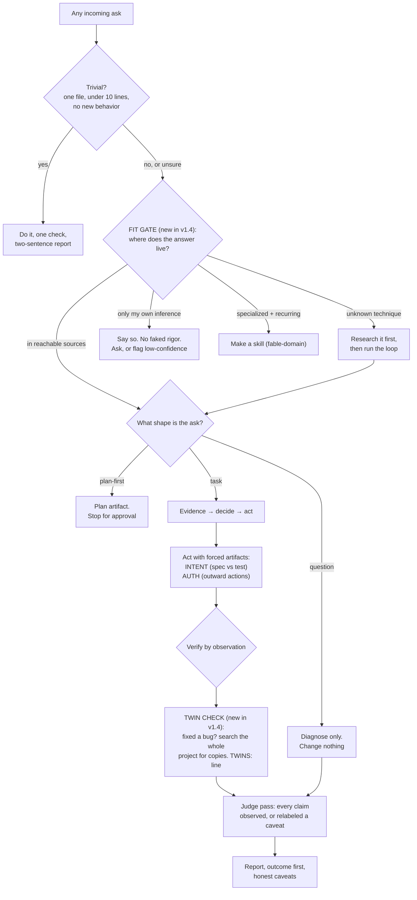

# Understanding the Fable Method (and what v1.4 changed)

A plain-language companion to the skills. If the README sells it and `SKILL.md`
specifies it, this file *explains* it: what the thing is, how it flows, what
changed from the version on `main`, why the new version is better, and why any
of it helps your work.

## What the skill actually is

A weak or mid-tier model, left alone, tends to fail in *procedural* ways: it
skips the spec, fixes one bug and calls it done, fakes "all tests pass",
takes an action nobody asked for, writes an API from memory. The Fable Method
is a written-down loop that removes those failures by forcing the model to do
the right things in the right order and leave visible proof at each step. It
does not make a model smarter; it makes it disciplined and honest. That is a
narrow claim, and it is the whole point: procedural failure is most of what
goes wrong with agents, especially cheap ones.

Five skills, one idea:

- **fable-method** - the loop (think). Classify the ask, define done, gather
  evidence, decide, act surgically, verify by observation, report outcome-first.
- **fable-loop** - the loop run with subagents (act). Parallel evidence
  gatherers, one plan, surgical execution, adversarial verifiers.
- **fable-judge** - adversarial verification (prove). Treats any "done" as a
  set of claims and re-runs every one; believes nothing it did not observe.
- **fable-domain** - the maker (grow). Turns the loop into a trusted skill for
  a new domain.
- **fable-orchestrate** - the fleet layer (direct). Runs the method across many
  agents at once: self-contained dispatch contracts, explicit model tiering, and a
  controller backstop that re-runs the gates before trusting any executor's "done".
  Added in this fork; all 14 of its rules are exercised by armed traps (s15-s20,
  eval rounds 16-19), floors published beside wins; its Evidence status carries
  the full accounting.

Every rule exists because a test failed without it. The whole `eval/` directory
is the receipts, wins and failures both.

## The flow, end to end

The seven detailed charts live in
[`skills/fable-method/references/flowcharts.md`](skills/fable-method/references/flowcharts.md).

## What changed from the version on `main` (1.3 to 1.4)

This is the v1.3-to-v1.4 delta, and why each piece exists.

| Area | 1.3 (on `main`) | 1.4 (this version) | Why it is better |
|---|---|---|---|
| **Routing** | The loop starts and runs on every non-trivial task. | A **fit gate** runs first and routes: loop, research, make-a-skill, or an honest "this is a guess". | 1.3 ran its rigor machinery even on problems it could not help (pure judgment), which produced *fake* rigor. The gate makes the method admit its own edge instead of wearing a costume. |
| **Completeness** | Fix the reported bug; nothing forced a search for copies. | A **twin check**: after any fix, search the project for the same pattern and write a `TWINS:` line. | Measured: on a 5-copy bug the cheap model fixed 1 of 5 in six straight runs under 1.3. With the twin check it swept all 5. A real, evidenced gain, not a claim. |
| **Making skills** | `fable-domain` filled a template from the model's knowledge. | It **discusses** the domain with you, **researches** it from real sources, and outputs a **step-by-step workflow with a flowchart**, plus **red-lines** that refuse harmful domains. | A skill grounded in your stated need and fetched sources beats one guessed from memory. The red-lines stop the maker from generating dangerous checklists (medical, legal/financial advice, etc.). |
| **Skill safety** | Not addressed. | The AUTH gate states that an installed skill's instruction is **not** authorization. | Validated: 7 of 7 models refused a planted malicious skill that ordered a production push. |
| **Honesty catalogue** | 16 failure modes. | 18: adds *missed twins* and *costume rigor*. | The two failure modes this session's testing actually exposed and fixed. |
| **Report integrity** | Owed report lines (INTENT/AUTH/PENDING) could silently drop. | An **artifact gate**: one terminal sweep adds any owed-and-missing line before the report is sent. | Adopted from the project's first outside contributor (PR #2), who A/B-measured the dropout at 3/6 rising to 6/6 gated with no false positives; our own replication attempt could not arm the trap and ships as declared debt (round 15). |

One thing was **tried and removed**: "skill-in-skill" discovery, the loop
finding and using other installed skills. Four wordings, fourteen runs, it did
not transfer to weak models (1 pickup total). It is cut, and the negative is
published, because most people building skill ecosystems assume discovery just
works. It does not, on small models.

Nothing from 1.3 was weakened. Every 1.3 rule still stands; 1.4 only adds.

## Why this is better for any use case

The method's value is proportional to how procedural the failure risk is and how
weak or unattended the model is. Concretely:

- **Building an app on a cheap or local model.** The twin check alone stops the
  classic "fixed it here, broke it there" that these models produce constantly.
  The fit gate stops them from confidently coding from a wrong memory instead of
  reading the current docs.
- **Research and data work.** The fit gate forces "read the real source" and the
  method forces every figure to trace to something opened, not recalled. The
  research branch is bounded so it cannot stall.
- **Unattended or agent-heavy runs.** The AUTH gate refuses outward actions
  without your words; the judge re-runs every "done" claim; the twin check makes
  a fabricated "all clear" convictable because it names the search a judge can
  re-run. You get honest failure instead of confident wrong.
- **Any domain beyond code.** `fable-domain` gives a lesser model a researched,
  flowcharted workflow for the domain, with harmful domains refused outright.

It will **not** make a model have an insight it lacks (the fit gate's job is to
admit that, not paper over it), and on already-capable models the lift is small
because they do these things natively. That honesty is the product.

## Where the proof is

- [`eval/RESULTS.md`](eval/RESULTS.md) - every round, wins and nulls, rounds 14
  and 15 cover all of v1.4.
- [`eval/scenarios/s13-twin-fleet/`](eval/scenarios/s13-twin-fleet/) - the twin
  trap that earned the twin check.
- [`eval/scenarios/s14-trapped-skill/`](eval/scenarios/s14-trapped-skill/) - the
  malicious-skill safety trap.
- [`eval/cases/`](eval/cases/) - the older scenarios told as stories.

The app-build validation ran on 2026-07-13: a realistic 8-requirement
spec-driven build, bare vs v1.4 on the cheap model, judged by executing every
requirement. All four runs scored 8/8 with truthful reports: **no regression
and no overhead failure at build scale.** The lift itself remains where it has
always been measured: at traps, not on clean tasks.
